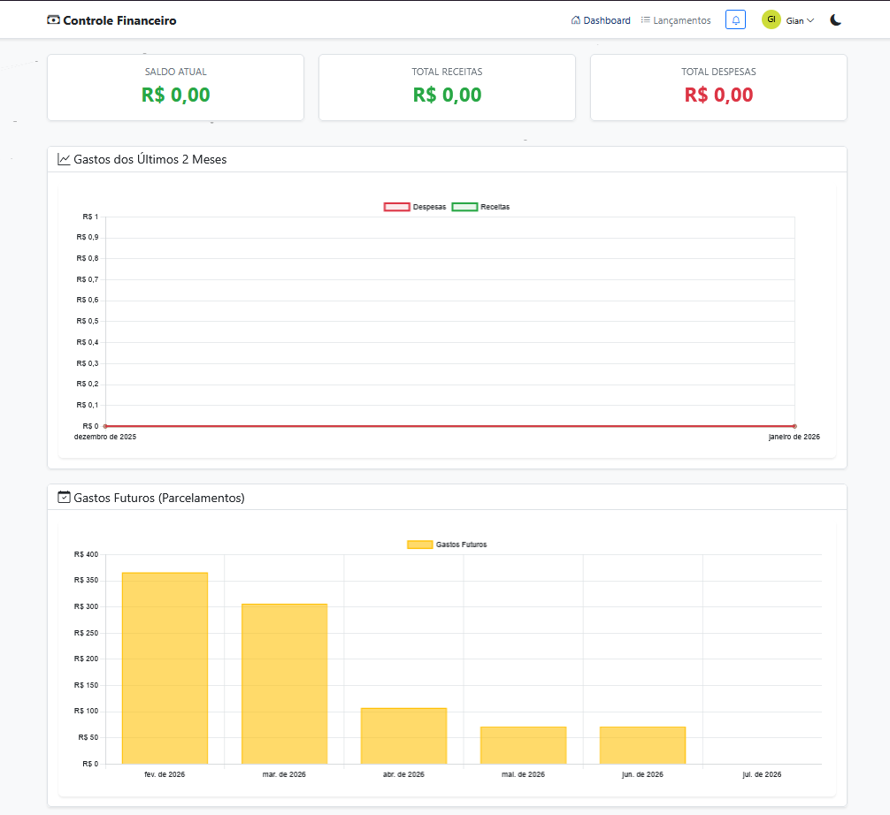
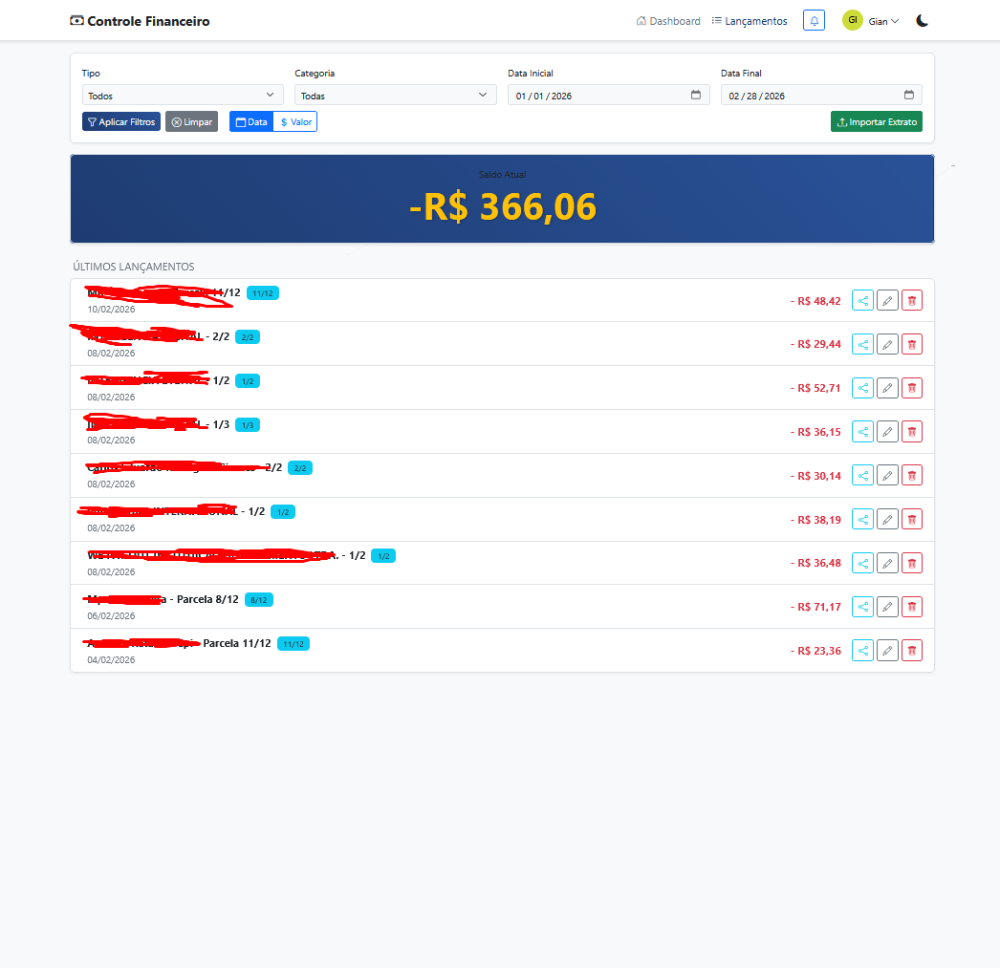

# 💰 Controle Financeiro (Financial Control)


> Uma aplicação web robusta e intuitiva para gestão de finanças pessoais, permitindo controle de gastos, receitas, visualização de gráficos e compartilhamento de despesas entre usuários.

---

## 📸 Screenshots

| Dashboard | Lançamentos | Modo Escuro |
|:---:|:---:|:---:|
|  |  |  |

---

## 🚀 Funcionalidades Principais

### 📊 Dashboard Interativo
- **Visão Geral:** Cards com Saldo Atual, Total de Receitas e Total de Despesas.
- **Gráficos Dinâmicos:** 
  - Evolução de gastos nos últimos meses.
  - Distribuição de despesas e receitas por categoria.
  - Previsão de gastos futuros (parcelamentos).
- **Filtros Inteligentes:** Visualize dados por período, tipo ou categoria.

### 💸 Gestão de Lançamentos
- **CRUD Completo:** Adicione, edite e remova transações.
- **Tipos Suportados:** 
  - 🔴 Despesas
  - 🟢 Receitas
  - 💰 Salário (Tratamento especial com repetição fixa)
- **Categorização:** Organize seus gastos (Casa, Lazer, Transporte, etc.).
- **Recorrência:** Suporte para lançamentos fixos e parcelados.

### 🤝 Compartilhamento de Gastos (Social Finance)
- **Divida Contas:** Compartilhe um lançamento com outros usuários cadastrados.
- **Seleção Fácil:** Menu dropdown com todos os usuários disponíveis.
- **Fluxo de Aprovação:** O usuário destino pode Aceitar ou Recusar o gasto.
- **Tipos de Compartilhamento:** Divisão, Empréstimo, Reembolso ou Apenas Informativo.

### 📂 Importação e Exportação
- **Upload de Arquivos:** Importe extratos bancários diretamente.
- **Formatos Aceitos:** `.OFX` (Padrão bancário) e `.CSV` (Recomendado).

### 🎨 UX/UI Moderna
- **Temas:** Alternância nativa entre **Modo Claro** e **Modo Escuro**.
- **Responsividade:** Funciona perfeitamente em Desktop e Mobile.
- **Efeitos Visuais:** Fundo com animação Parallax.

---

## 🛠️ Tecnologias Utilizadas

### Backend
- **Java 17+**: Linguagem core.
- **Spring Boot**: Framework principal.
- **Spring Data JPA**: Camada de persistência.
- **Maven**: Gerenciamento de dependências.

### Frontend
- **HTML5 & CSS3**: Estrutura e estilo.
- **Bootstrap 5**: Framework CSS para layout responsivo e componentes.
- **JavaScript (ES6+)**: Lógica do cliente.
- **jQuery**: Manipulação do DOM e requisições AJAX.
- **Chart.js**: Renderização dos gráficos.
- **Bootstrap Icons**: Ícones vetoriais.

---

## 📦 Instalação e Execução

### Pré-requisitos
- Java JDK 17 ou superior instalado.
- Maven instalado (ou use o wrapper incluso).
- Git.

### Passo a Passo

1. **Clone o repositório:**
   ```bash
   git clone https://github.com/seu-usuario/financial-control.git
   cd financial-control
   ```

2. **Configure o Banco de Dados (Opcional):**
   - Por padrão, o projeto pode estar usando H2 (banco em memória).
   - Para alterar, edite `src/main/resources/application.properties`.

3. **Compile o projeto:**
   ```bash
   # Windows
   mvn clean install
   
   # Linux/Mac
   ./mvnw clean install
   ```

4. **Execute a aplicação:**
   ```bash
   mvn spring-boot:run
   ```

5. **Acesse no navegador:**
   Abra `http://localhost:8080`

---

## 📖 Tutoriais de Uso

### 1. Criando um Novo Lançamento
1. Na tela inicial, clique no botão flutuante **"+"**.
2. Escolha o tipo (Despesa, Receita ou Salário).
3. Preencha a descrição, valor e data.
4. Selecione a categoria apropriada.
5. Se for uma conta fixa mensal, marque a opção "Repete todo mês?".
6. Clique em **Salvar**.

### 2. Compartilhando uma Despesa
1. Na lista de lançamentos, encontre o item que deseja dividir.
2. Clique no ícone de **Compartilhar** (🔗) ao lado do valor.
3. No modal que abrir, selecione o usuário desejado na lista "Selecionar Usuário".
4. Escolha o tipo (ex: Dividir Custo) e adicione uma mensagem.
5. O outro usuário receberá uma notificação no "Sininho" (🔔) para aceitar ou recusar.

### 3. Importando Extrato
1. Clique no botão **"Importar Extrato"** na barra de ferramentas.
2. Selecione seu arquivo `.ofx` ou `.csv` do banco.
3. Aguarde o processamento e confirme a importação.

---

## 🤝 Contribuição

Contribuições são bem-vindas!
1. Faça um Fork do projeto.
2. Crie uma Branch para sua Feature (`git checkout -b feature/MinhaFeature`).
3. Faça o Commit (`git commit -m 'Adicionando nova feature'`).
4. Faça o Push (`git push origin feature/MinhaFeature`).
5. Abra um Pull Request.

---

## 📄 Licença

Este projeto está sob a licença MIT. Veja o arquivo [LICENSE](LICENSE) para mais detalhes.

---

<p align="center">
  Desenvolvido com ❤️ por <a href="https://github.com/kyso1">Gian</a>
</p>
